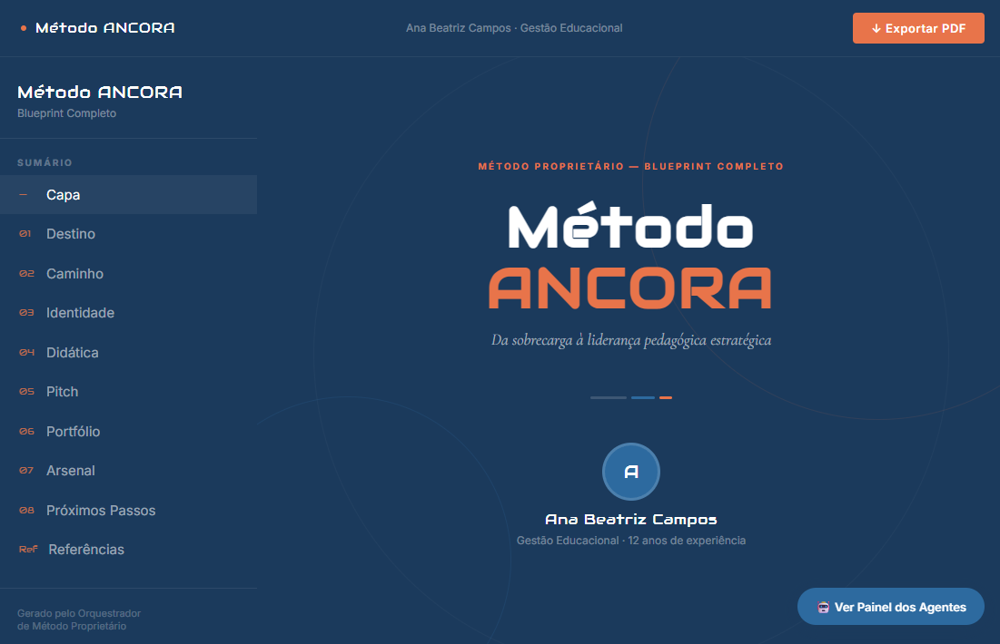
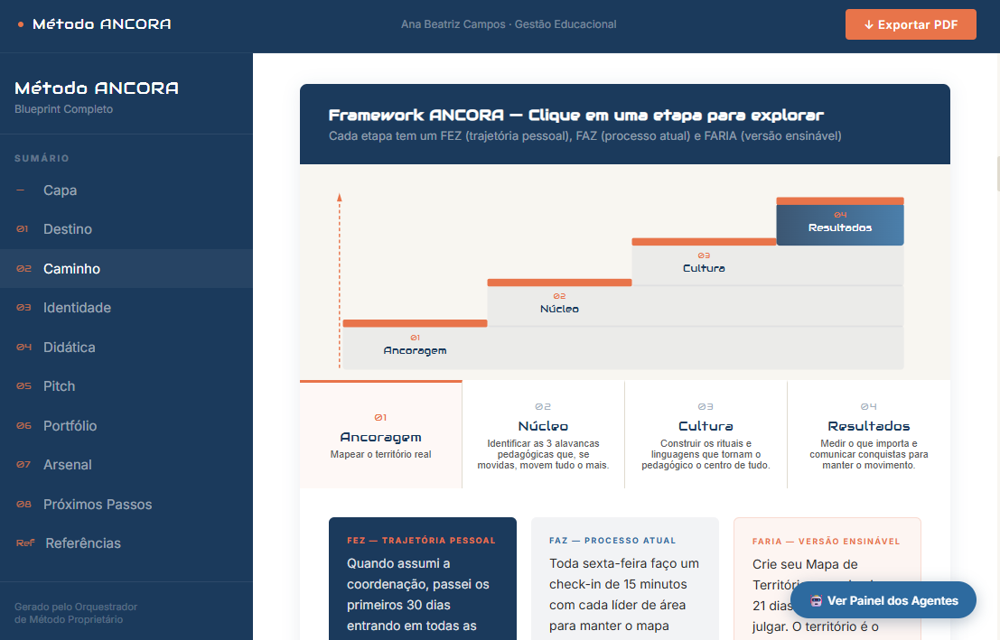
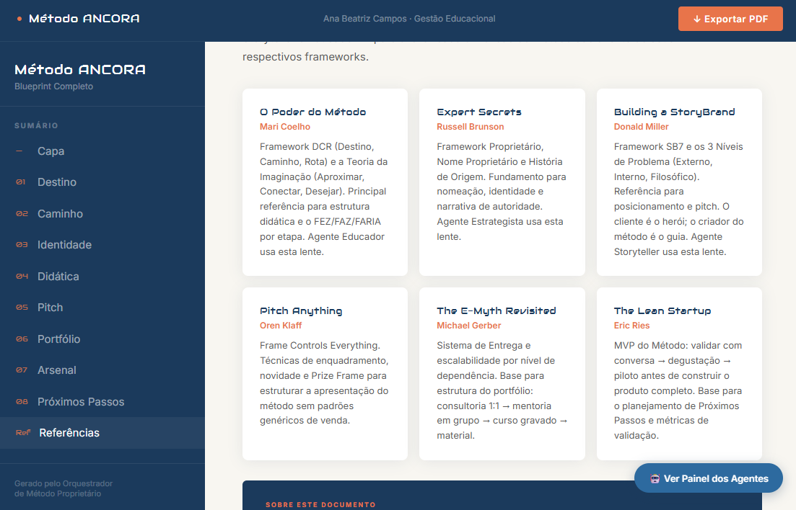

# Orquestrador de Método Proprietário

> Sistema multi-agente que transforma o conhecimento de um especialista em um **método proprietário completo** — com nome, identidade visual, pitch, portfólio e blueprint navegável em HTML premium.

Baseado na metodologia **"O Poder do Método"** de Mari Coelho, integrado com Expert Secrets (Brunson), StoryBrand (Miller), Pitch Anything (Klaff) e E-Myth (Gerber).

---

## Demo

**[→ Ver exemplo: Método ANCORA](./exemplo-v2.html)**

Blueprint completo gerado pelo sistema para Ana Beatriz Campos — especialista em Gestão Educacional com 12 anos de experiência.

| | |
|---|---|
|  |  |
| **Capa** — nome do método em display, sidebar com TOC ativo | **Caminho** — framework interativo com 4 tabs clicáveis |
|  |  |
| **Painel dos Agentes** — bastidores ocultos no PDF | **Referências** — créditos das 6 metodologias base |

**O que o exemplo demonstra:**
- Layout e-book de duas colunas com sidebar navegável e TOC ativo por scroll
- Framework DCR interativo — 4 tabs clicáveis, cada um revela FEZ/FAZ/FARIA
- Identidade visual gerada automaticamente a partir do Blueprint JSON
- Seção de Referências Metodológicas (Mari Coelho, Brunson, Miller, Klaff, Gerber, Ries)
- Painel dos Agentes — bastidores visíveis para o criador, ocultos no PDF
- Export PDF via `window.print()` com `@media print` otimizado para A4

---

## O que o sistema entrega

Um especialista responde perguntas numa conversa. Ao final, recebe:

| Entrega | Descrição |
|---|---|
| **Blueprint HTML** | Arquivo único autocontido, navegável, com identidade do método |
| **Export PDF** | Impressão premium via browser — preserva cores, SVGs e tipografia |
| **Painel dos Agentes** | Bastidores visíveis: deliberações dos 3 especialistas que construíram o método |

Não é um template. É um sistema que extrai o método que já existe dentro da pessoa e o organiza em algo que **ninguém mais pode copiar** — porque a Rota é a trajetória pessoal de quem viveu aquilo.

---

## Arquitetura — 6 Fases

```
FASE 1   Briefing Conversacional
           Orquestrador faz perguntas em 3 rodadas
           Aceita texto, arquivos e fotos
           Gera Dossiê de Contexto em JSON
                    ↓
FASE 2   Agente DCR  ← sequencial, bloqueante
           Destino (Ponto A → Ponto B)
           Caminho (3–5 etapas nomeadas)
           Rota (FEZ / FAZ / FARIA por etapa)
                    ↓
FASE 3   4 Subagentes em paralelo
         ┌──────────┬──────────┬──────────┬──────────┐
         │Identidade│ Didática │ Produto  │ Arsenal  │
         └──────────┴──────────┴──────────┴──────────┘
                    ↓
FASE 4   Painel de Especialistas — 3 personas em paralelo
         ┌────────────┬─────────────┬──────────────┐
         │ Strategist │ Storyteller │   Educator   │
         │  (Brunson) │   (Miller)  │  (Coelho)    │
         └────────────┴─────────────┴──────────────┘
           Deliberação visível — o usuário vê o painel
                    ↓
FASE 5   Agente Blueprint
           Lê todos os outputs + deliberação do painel
           Gera Blueprint final em JSON estruturado
                    ↓
FASE 6   HTML Premium
           Layout e-book responsivo
           Framework interativo (tabs FEZ/FAZ/FARIA)
           Painel dos Agentes (oculto no PDF)
           Export via window.print() com @media print
```

---

## Subagentes

### Fase 2 — Agente DCR (sequencial, bloqueante)

| Campo | Detalhe |
|---|---|
| Arquivo | `agents/dcr.md` |
| Recebe | Dossiê de Contexto JSON |
| Entrega | Ponto A e B · 3–5 etapas nomeadas · FEZ/FAZ/FARIA por etapa · Ferramenta por etapa |

### Fase 3 — Paralelos

| Agente | Arquivo | Entrega |
|---|---|---|
| Identidade | `agents/identidade.md` | Nome proprietário · tagline · cores · forma visual |
| Didática | `agents/didatica.md` | Teoria da Imaginação (Aproximar/Conectar/Desejar) · erros comuns |
| Produto | `agents/produto.md` | Portfólio 3 níveis · pitch 1 frase · pitch 5 elementos · precificação |
| Arsenal | `agents/arsenal.md` | Frases autorais · história de origem · MVP 30 dias |

### Fase 4 — Painel de Especialistas (paralelo)

Três personas leem **todos** os outputs das Fases 2 e 3 e deliberam simultaneamente.

```
━━ PAINEL DE ESPECIALISTAS ━━━━━━━━━━━━━━━━━━━━━━

Strategist  (Expert Secrets / Brunson)
  ✓ ponto forte
  ⚠ ajuste recomendado
  → recomendação específica

Storyteller (StoryBrand / Miller)
  ✓ ponto forte
  ⚠ ajuste recomendado
  → recomendação específica

Educator    (O Poder do Método / Coelho)
  ✓ ponto forte
  ⚠ ajuste recomendado
  → recomendação específica

━━ SÍNTESE ━━━━━━━━━━━━━━━━━━━━━━━━━━━━━━━━━━━━
[decisão — maioria decide em conflito]
```

### Fase 5 — Agente Blueprint

Consolida todos os outputs em um JSON estruturado que alimenta o HTML generator.

```json
{
  "criador": { "nome": "", "area": "", "anos_experiencia": 0, "bio": "" },
  "destino": { "publico": "", "ponto_a": "", "ponto_b": "" },
  "identidade": {
    "nome_oficial": "", "sigla": "", "tagline": "", "frase_autoral": "",
    "forma_visual": "escada|roda|funil|mapa|matriz",
    "cores": { "primaria": "#", "secundaria": "#", "acento": "#" }
  },
  "caminho": [
    { "ordem": 1, "nome": "", "descricao": "", "fez": "", "faz": "", "faria": "", "ferramenta": "" }
  ],
  "didatica": { "aproximar": "", "conectar": "", "desejar": "" },
  "pitch": {
    "uma_frase": "", "quem": "",
    "problema_externo": "", "problema_interno": "", "problema_filosofico": "",
    "solucao": "", "diferencial": "", "resultado": ""
  },
  "portfolio": [
    { "nivel": "Entrada|Core|Premium", "nome": "", "formato": "", "descricao": "", "preco_faixa": "" }
  ],
  "arsenal": {
    "frases_autorais": [],
    "historia_origem": { "situacao": "", "tentativa": "", "insight": "", "metodo": "", "resultado": "" },
    "mvp_30_dias": "", "proximo_passo": ""
  },
  "rota_resumo": "",
  "painel_sintese": "",
  "painel_agentes": {
    "estrategista": { "nome": "", "avaliacao": "", "nota": "" },
    "storyteller":  { "nome": "", "avaliacao": "", "nota": "" },
    "educador":     { "nome": "", "avaliacao": "", "nota": "" }
  }
}
```

---

## HTML Premium — Fase 6

Arquivo único, sem dependências externas além das Google Fonts.

### Layout

| Área | Detalhe |
|---|---|
| Header | Nome do método · meta do criador · botão Export PDF |
| Sidebar | 288px · TOC com 10 seções · nome do método em Audiowide · active tracking via scroll |
| Main | Scroll independente · 10 seções navegáveis |

### Seções do Blueprint

| # | Seção | Conteúdo |
|---|---|---|
| — | Capa | Nome do método em display · tagline · avatar do criador |
| 01 | Destino | Stat blocks · público-alvo · jornada A→B |
| 02 | Caminho | SVG escada decorativo · framework interativo (4 tabs FEZ/FAZ/FARIA) |
| 03 | Identidade | Nome · tagline · frase autoral · paleta de cores |
| 04 | Didática | Teoria da Imaginação (Aproximar → Conectar → Desejar) |
| 05 | Pitch | Frase de 1 linha · 3 níveis de problema · frame completo |
| 06 | Portfólio | 3 produtos escalonados com nível, formato e faixa de preço |
| 07 | Arsenal | Frases autorais · história de origem em timeline |
| 08 | Próximos Passos | MVP 30 dias · primeira ação · síntese do painel |
| Ref | Referências | Créditos das 6 metodologias base |

### Identidade Visual Automática

As cores do Blueprint JSON são injetadas como CSS variables via JavaScript:

```js
document.documentElement.style.setProperty('--primaria',   cores.primaria);
document.documentElement.style.setProperty('--secundaria', cores.secundaria);
document.documentElement.style.setProperty('--acento',     cores.acento);
```

Cada blueprint recebe a identidade visual do próprio método — não um template genérico.

### Tipografia

| Família | Uso |
|---|---|
| **Audiowide** | Títulos de display · nome do método · capítulos · sidebar |
| **Cormorant Garamond** | Pull quotes · frases autorais · frase da capa |
| **Inter** | Corpo de texto · labels · UI |

### Export PDF

Geração via `window.print()` com `@media print` otimizado:

- `@page { size: A4; margin: 18mm 20mm }`
- Framework interativo substituído por step cards expandidos
- Sidebar e header ocultos
- Painel dos Agentes oculto (`display: none !important`)
- `print-color-adjust: exact` em todos os elementos

### Painel dos Agentes

Botão flutuante `🤖 Ver Painel dos Agentes` abre um modal com os pareceres completos dos 3 especialistas — Estrategista, Storyteller e Educador. Visível apenas no browser, **nunca aparece no PDF**.

---

## Estrutura de Arquivos

```
orquestrador-metodo/
├── README.md                         ← este arquivo
├── SPEC.md                           ← spec de arquitetura completa
├── SKILL.md                          ← orquestrador · entrada da skill
├── exemplo-v2.html                   ← demo · Blueprint Método ANCORA
│
├── imagens/                          ← screenshots do exemplo
│   ├── 01.capa.png
│   ├── 02.Caminho.png
│   ├── 03.Avaliação dos Agentes.png
│   └── 04.Referências.png
│
├── agents/
│   ├── dcr.md                        ← fase 2 · sequencial · bloqueante
│   ├── identidade.md                 ← fase 3 · paralelo
│   ├── didatica.md                   ← fase 3 · paralelo
│   ├── produto.md                    ← fase 3 · paralelo
│   ├── arsenal.md                    ← fase 3 · paralelo
│   ├── painel-strategist.md          ← fase 4 · deliberação (Brunson)
│   ├── painel-storyteller.md         ← fase 4 · deliberação (Miller)
│   ├── painel-educator.md            ← fase 4 · deliberação (Coelho)
│   └── blueprint.md                  ← fase 5 · síntese final
│
├── references/
│   ├── frameworks-complementares.md  ← Brunson · Miller · Klaff · Gerber
│   └── html-structure.md             ← guia das seções do HTML
│
└── scripts/
    └── pdf-template.js               ← referência pdfmake (substituído por window.print)
```

---

## Decisões Técnicas

| Decisão | Escolha | Razão |
|---|---|---|
| Export PDF | `window.print()` + `@media print` | Preserva SVGs, cores e tipografia sem dependência de biblioteca |
| Framework interativo | Tabs JS com painel dinâmico | Mais limpo e confiável que SVG clicável |
| Identidade visual | CSS variables injetadas via JS | Um ponto de controle — todo o HTML reflete o JSON |
| Painel dos Agentes | Modal overlay com `display:none` no print | Bastidores visíveis para o criador, invisíveis no documento final |
| Tipografia | Audiowide + Cormorant Garamond + Inter | Display de impacto + elegância serif + legibilidade UI |
| Accordion / tabs | Estado gerenciado por JS simples | Sem framework, funciona em qualquer browser |

---

## Referências Metodológicas

| Obra | Autor | Lente no sistema |
|---|---|---|
| O Poder do Método | Mari Coelho | Framework DCR · Teoria da Imaginação · FEZ/FAZ/FARIA · Agente Educator |
| Expert Secrets | Russell Brunson | Nome proprietário · história de origem · Agente Strategist |
| Building a StoryBrand | Donald Miller | 3 níveis de problema · cliente como herói · Agente Storyteller |
| Pitch Anything | Oren Klaff | Frame controls · pitch structure · Agente Produto |
| The E-Myth Revisited | Michael Gerber | Portfólio escalonado · sistema de entrega |
| The Lean Startup | Eric Ries | MVP 30 dias · validação antes de construção |

---

Arquitetura e orquestração: **ODDATA / Trium Mind Advisory** — 2026.
